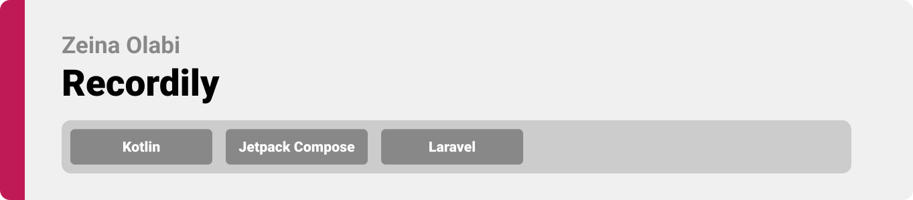
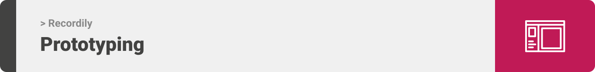
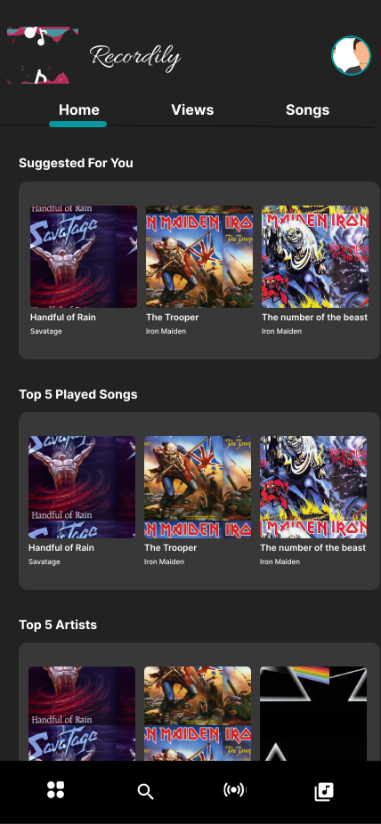
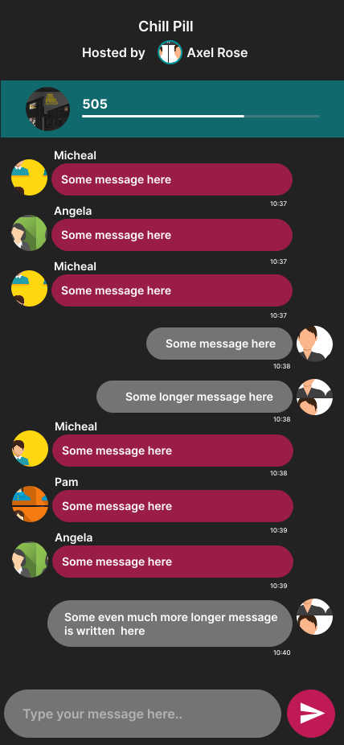
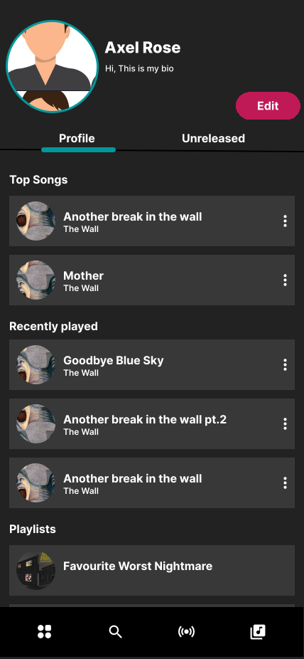
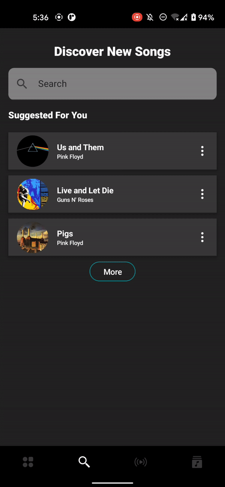
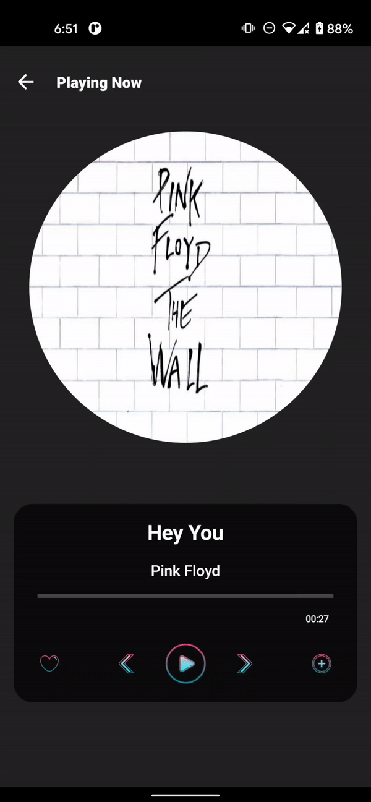

<div align="center">

> Hello, world! This is the project’s summary that describes the project plain and simple, limited to the space available. 



**[PROJECT PHILOSOPHY](https://github.com/zeinaolabi/recordily_client#-project-philosophy) • [WIREFRAMES](https://github.com/zeinaolabi/recordily_client#-wireframes) • [TECH STACK](https://github.com/zeinaolabi/recordily_client#-tech-stack) • [IMPLEMENTATION](https://github.com/zeinaolabi/recordily_client#-implementation) • [HOW TO RUN?](https://github.com/zeinaolabi/recordily_client#-how-to-run)**

</div>

<br><br>


> Recordily is an application where undiscovered artist can upload and stream their music. Recordily encourages artists to showcase their talent and show it to the word
by hosting live events for people to enjoy.
> 

### Artist Stories
- As an artist, I want to upload my songs, so people can enjoy them
- As an artist, I want to host live events, to introduce people to my music
- As an artist, I want to record my own songs, to upload them 
- As an artist, I want check my songs statistics, to keep track of my progress 

### User Stories
- As a listener, I want to create playlists, so I can customize my music
- As a listener, I want to follow artists, to keep up with the music industry
- As a listener, I want to save songs, so I can check them later

<br><br>



> This design was firstly implemented on Figma as wireframes, then moved to the mockups to finalize the details.

| Sign in                                       | Landing                                            | Live Events                                        | Live Event                                            |
|-----------------------------------------------|----------------------------------------------------|----------------------------------------------------|-------------------------------------------------------|
|  |  |   |  |

| Song                                            | Record                                            | Artist                                            | Profile                                            |
|-------------------------------------------------|---------------------------------------------------|---------------------------------------------------|----------------------------------------------------|
|  |  |  |  |


<br><br>


Here's a brief high-level overview of the tech stack Recordily app uses:

**Frontend**
- Android Native application that uses Kotlin as a programming language, following the MVVM architecture.
- The application follows the latest components:
  - Jetpack Compose
  - Jetpack Navigation
  - Coroutines
  
**Backend**
- Uses Laravel, which is a PHP framework that follow MVC.
- The database is built on MySQL.
- Docker image provided.
- CI using GitHub Actions.

<br><br>


> Using the above-mentioned tech stacks and the mockups built with Figma from the user stories we have, the implementation of the app is shown as below, these are screenshots from the real app.
The application works on both Light and Dark theme

| Landing                                       | Search                                       | Upload Song                                       | Live Event                                            |
|-----------------------------------------------|----------------------------------------------|---------------------------------------------------|-------------------------------------------------------|
|  |  |  |  |

| Song                                       | Record                                       | Library&Artist                                | Profile                                       |
|--------------------------------------------|----------------------------------------------|-----------------------------------------------|-----------------------------------------------|
|  |  |  |  |


<br><br>


>To get a local copy up and running, follow these simple steps.

### Prerequisites

This is an example of how to list things you need to use the software and how to install them.
* Docker
  ```sh
  install Docker from https://www.docker.com/
  ```

### Installation

1. Clone the repo
   ```sh
   git clone https://github.com/zeinaolabi/recordily_client.git
   ```
2. Change .env
   ```sh
   update .env according to your variables
   ```
3. Run Docker
   ```sh
   docker-compose up
   ```
4. Install APK
   ```sh
   install the application apk from GitHub Actions
   ```


